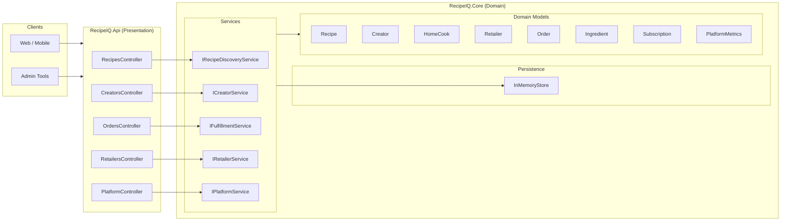
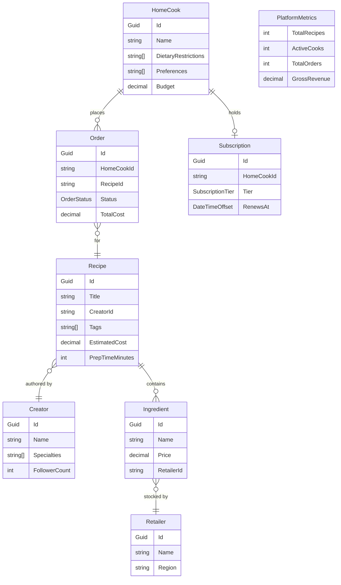
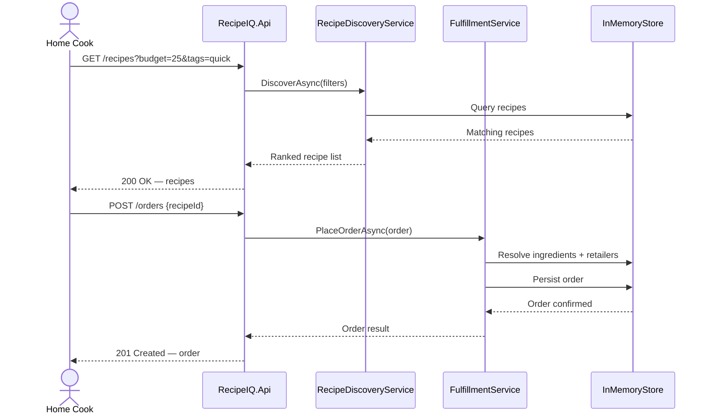
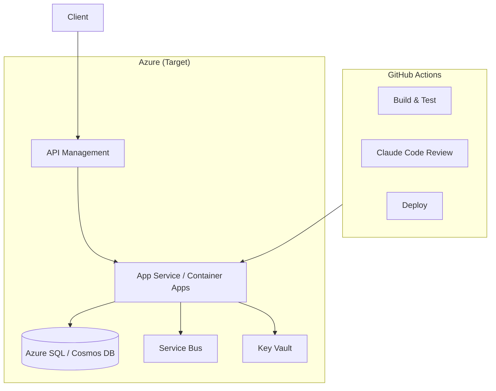

# RecipeIQ — System Architecture

## Overview

RecipeIQ is structured as a layered ASP.NET Core application implementing a four-sided marketplace. The current implementation uses an in-memory store and is designed for incremental growth toward a persistent, event-driven architecture.

## Component Architecture

## Domain Model

## Request Flow

## Deployment Architecture (Target)

## Architecture Decision Records

| # | Decision | Status | Notes |
|---|----------|--------|-------|
| ADR-001 | Use InMemoryStore for initial persistence | Accepted | Enables fast iteration; swap for EF Core when schema stabilizes |
| ADR-002 | Service interfaces (I*Service) for all domain services | Accepted | Enables DI and future test isolation |
| ADR-003 | One controller per marketplace participant | Accepted | Mirrors four-sided marketplace structure |
