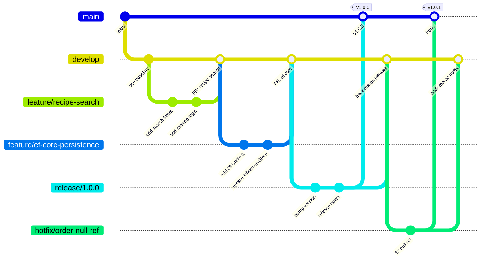
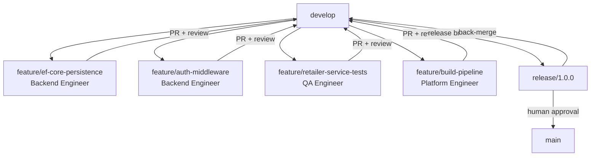
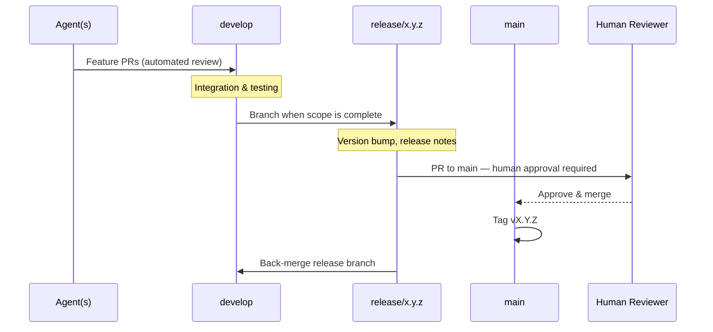

# RecipeIQ — Branching Strategy

RecipeIQ follows the **Gitflow workflow** as defined by Atlassian:
https://www.atlassian.com/git/tutorials/comparing-workflows/gitflow-workflow

This model supports parallel agent development across isolated feature branches while keeping `main` stable for production releases.

---

## Branch Model

---

## Branch Types

### `main`
- **Contains**: production-ready, released code only
- **Protected**: no direct commits; only merges from `release/*` and `hotfix/*`
- **Tagged**: every merge to `main` is tagged with a version (`v1.0.0`)
- **Requires**: human approval before merge

### `develop`
- **Contains**: latest integrated development work
- **The integration branch**: all feature branches merge here via PR
- **Source of truth** for agents — always branch feature work from here
- **Requires**: Claude Code Review pass before merge

### `feature/<name>`
- **Branches from**: `develop`
- **Merges into**: `develop` via PR
- **Naming**: `feature/<short-kebab-description>` (e.g., `feature/ef-core-persistence`)
- **Lifetime**: deleted after PR merges
- **Parallel-safe**: multiple agents can work on separate feature branches simultaneously

### `release/<version>`
- **Branches from**: `develop` when scope for a release is complete
- **Merges into**: `main` AND `develop`
- **Naming**: `release/<semver>` (e.g., `release/1.0.0`)
- **Purpose**: final stabilization, version bump, release notes — no new features
- **Requires**: human approval to merge to `main`

### `hotfix/<name>`
- **Branches from**: `main` (the specific release tag)
- **Merges into**: `main` AND `develop`
- **Naming**: `hotfix/<short-description>` (e.g., `hotfix/order-null-ref`)
- **Purpose**: urgent production fixes only — bypass the develop cycle
- **Requires**: human approval to merge to `main`

---

## Parallel Agent Workflow

Each agent works on its own feature branch. Branches are isolated, so agents don't block each other.

**Rules for agents working in parallel:**
- Branch from the latest `develop` at the start of work
- Keep feature branches short-lived — small, focused scope
- Rebase on `develop` if the branch diverges significantly before opening a PR
- Never merge directly — always via PR with Claude Code Review

---

## PR Rules

| PR Target | Branch Source | Required Checks | Approver |
|-----------|--------------|----------------|----------|
| `develop` | `feature/*` | Claude Code Review | Automated (CI pass) |
| `main` | `release/*` | Claude Code Review + build | Human required |
| `main` | `hotfix/*` | Claude Code Review + build | Human required |
| `develop` | `hotfix/*` | Claude Code Review | Automated (CI pass) |

---

## Release Cycle

---

## Version Tagging

- Tags follow semantic versioning: `vMAJOR.MINOR.PATCH`
- Every merge to `main` must be tagged
- Tag message should summarize the release scope
