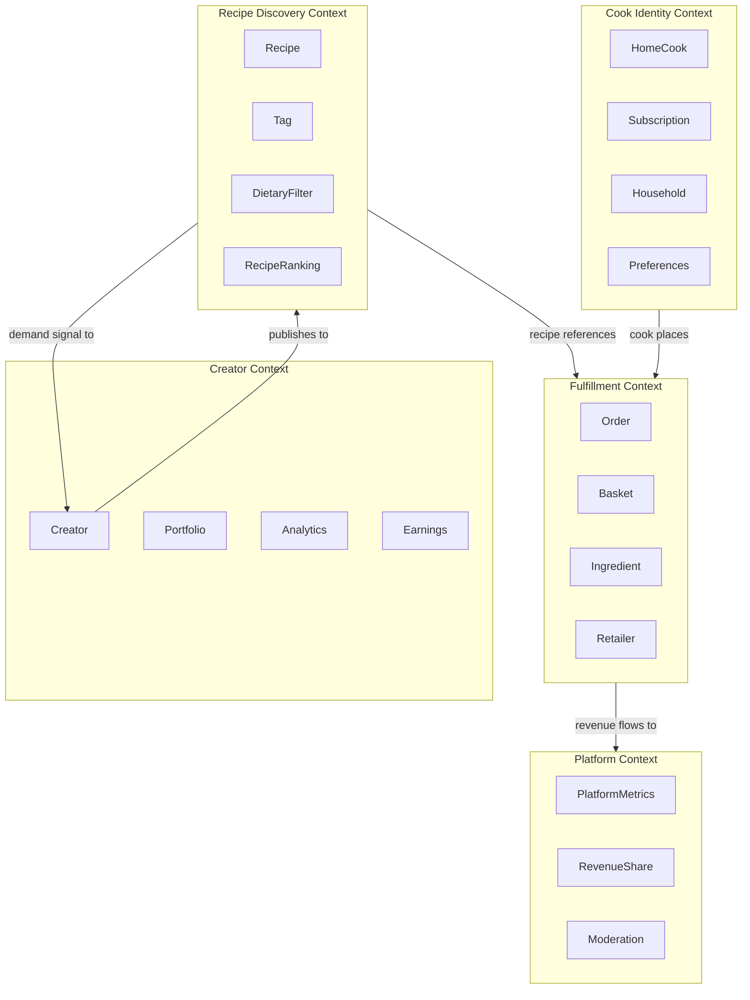
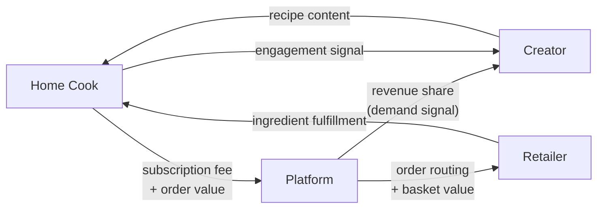

# RecipeIQ — Domain Model

## Bounded Contexts

## Value Flows

## Core Aggregates

### Recipe (Discovery Context)
- Root entity owned by a `Creator`
- Contains a list of `Ingredient` references (fulfilled in Fulfillment context)
- Carries tags, dietary flags, estimated cost, and prep time
- Ranked by the `RecipeDiscoveryService` based on cook preferences

### HomeCook (Identity Context)
- Root entity representing a platform user
- Holds dietary restrictions, preferences, and budget constraints
- May hold a `Subscription` (tier: Free | Premium)

### Order (Fulfillment Context)
- Root aggregate representing a cook's intent to make a recipe
- Resolves `Ingredient` availability across `Retailer` inventory
- Tracks `OrderStatus`: Pending → Confirmed → Fulfilled

### Basket (Fulfillment Context)
- Value object produced when an Order resolves its Recipe's ingredients
- Groups ingredients by Retailer for fulfillment routing
- Lifecycle is tied to its parent Order — not persisted independently

### Creator (Creator Context)
- Root entity representing a recipe author
- Accrues analytics from recipe engagement and orders placed

## Domain Language (Ubiquitous Language)

| Term | Meaning |
|------|---------|
| Discovery | The act of surfacing relevant recipes to a home cook |
| Fulfillment | Resolving and delivering the ingredients for a recipe |
| Demand Signal | Aggregate data about which recipes are being saved/cooked |
| Revenue Share | Platform distribution of order revenue to creators and retailers |
| Household | The cook's family/living context that shapes portion and dietary needs |
| Basket | The set of ingredients derived from a recipe for a single order |
