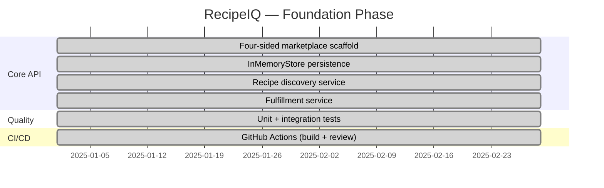

# RecipeIQ — Feature Roadmap

## Now (Foundation)

## Next (Persistence & Auth)

- Replace `InMemoryStore` with EF Core + SQL database
- Add authentication (ASP.NET Core Identity or external IdP)
- Introduce cook profile management endpoints
- Expand recipe filtering (dietary, budget, prep time, household size)

## Later (Scale & Ecosystem)

- Creator analytics dashboard
- Retailer inventory sync API
- Subscription billing (Stripe integration)
- Demand signal reporting for creators
- Search and personalization (vector embeddings)

## Backlog Items

| Priority | Feature | Context |
|----------|---------|---------|
| High | EF Core persistence | ADR-001 — swap InMemoryStore |
| High | Auth & identity | Required before any user data goes live |
| Medium | Recipe search with filters | Core cook experience |
| Medium | Creator earnings/analytics | Marketplace health |
| Low | Retailer inventory webhooks | Fulfillment accuracy |
| Low | Mobile client | Growth channel |
