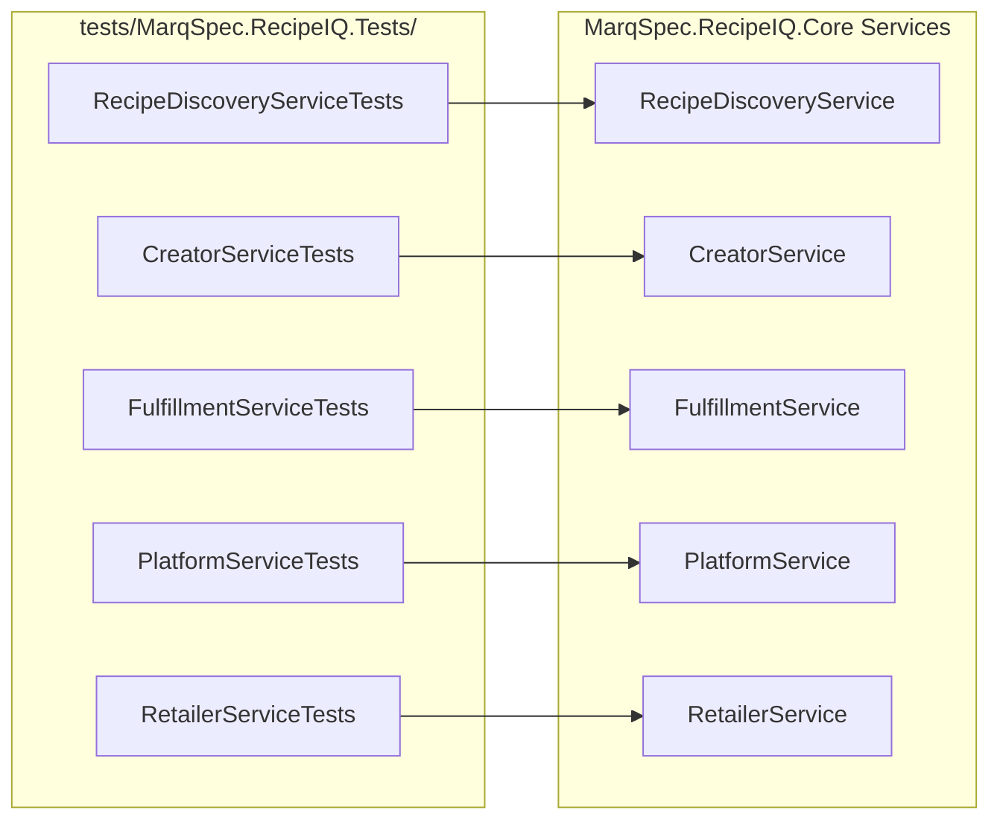

# QA — Test Coverage State

## Current Coverage

```mermaid
graph LR
    subgraph Tests["tests/MarqSpec.RecipeIQ.Tests/"]
        RDT[RecipeDiscoveryServiceTests]
        CT[CreatorServiceTests]
        FT[FulfillmentServiceTests]
        PT[PlatformServiceTests]
        RT[RetailerServiceTests]
    end

    subgraph Services["MarqSpec.RecipeIQ.Core Services"]
        RDS[RecipeDiscoveryService]
        CS[CreatorService]
        FS[FulfillmentService]
        PS[PlatformService]
        RS[RetailerService]
    end

    RDT --> RDS
    CT --> CS
    FT --> FS
    PT --> PS
    RT --> RS
```

## Gaps

- `RetailerService` — test file not yet written. **Next priority.**
