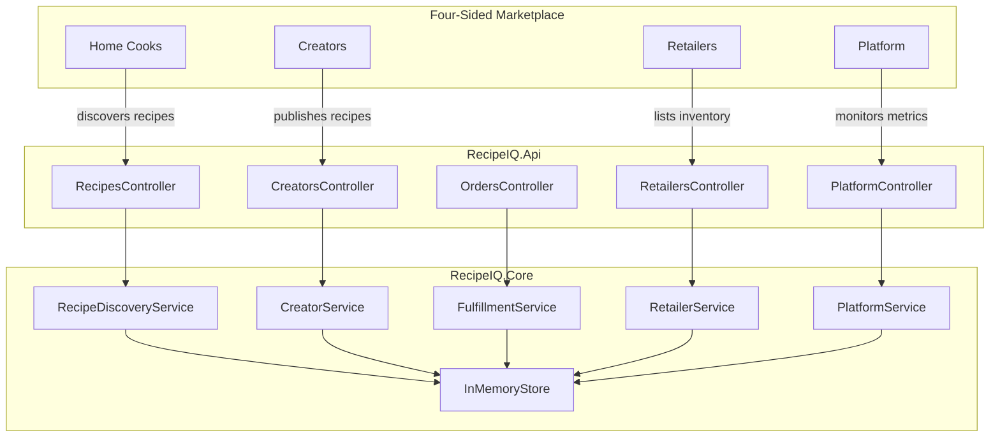

# RecipeIQ — Agentic Development Organization

RecipeIQ is a personalized home cooking platform connecting home cooks, recipe creators, retailers, and the platform itself in a four-sided marketplace. It matches people to recipes suited to their moment, household, dietary needs, and budget, with seamless ingredient fulfillment and a creator ecosystem powered by real demand signal.

## Solution Structure

```
RecipeIQ/
├── CLAUDE.md                  # This file — org overview and agent roster
├── .docs/                     # Master architecture and planning documents
│   ├── architecture.md        # System architecture and component diagrams
│   ├── domain-model.md        # Domain model and bounded contexts
│   └── roadmap.md             # Feature roadmap and planning
├── .org/                      # Agent personas and shared org context
│   ├── shared/                # Shared conventions and glossary (all agents reference)
│   ├── architect/             # Architect agent persona and context
│   ├── backend/               # Backend engineer agent persona and context
│   ├── qa/                    # QA engineer agent persona and context
│   └── platform/              # Platform engineer agent persona and context
├── src/
│   ├── RecipeIQ.Api/          # ASP.NET Core Web API (controllers, entry point)
│   └── RecipeIQ.Core/         # Domain models and services
└── tests/
    └── RecipeIQ.Tests/        # xUnit integration and unit tests
```

## Agent Roster

| Agent | Persona File | Responsibilities |
|-------|-------------|-----------------|
| Architect | [.org/architect/CLAUDE.md](.org/architect/CLAUDE.md) | System design, ADRs, cross-cutting concerns, diagram ownership |
| Backend Engineer | [.org/backend/CLAUDE.md](.org/backend/CLAUDE.md) | .NET/C# API, domain services, data layer, feature implementation |
| QA Engineer | [.org/qa/CLAUDE.md](.org/qa/CLAUDE.md) | Test strategy, test authoring, quality gates, coverage |
| Platform Engineer | [.org/platform/CLAUDE.md](.org/platform/CLAUDE.md) | CI/CD, GitHub Actions, infrastructure, observability |

## High-Level Architecture



## Collaboration Model

- **Architect** sets direction via `.docs/` — all agents read architecture before implementing.
- **Backend Engineer** owns `src/` and implements features aligned to the architecture.
- **QA Engineer** owns `tests/` and maintains quality gates for every feature shipped.
- **Platform Engineer** owns `.github/workflows/` and ensures CI passes before merge.
- All agents write their working context to their own folder under `.org/<agent>/context/`.
- All diagrams are authored in Mermaid format.
- Shared conventions and domain language live in [.org/shared/](.org/shared/).

## Key Conventions

- Language: C# / .NET (latest LTS)
- API style: RESTful, controller-per-domain-concept
- Tests: xUnit, no mocking of domain services — prefer integration style against `InMemoryStore`
- Diagrams: Mermaid (`.md` files in `.docs/` or agent context folders)
- Branch strategy: feature branches off `main`, PRs reviewed by Claude Code Review workflow
