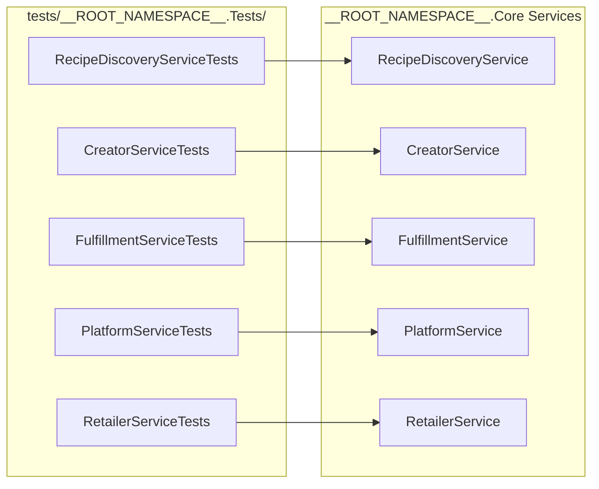

# QA — Test Coverage State

## Current Coverage

## Gaps

- `RetailerService` tests exist in `tests/__ROOT_NAMESPACE__.Tests/RetailerServiceTests.cs`.
- Add edge-case scenarios for zero-inventory, region mismatch, and duplicate retailer naming.

